# AIR OTC Architecture

Last updated: 2026-07-02

AIR OTC is a private OTC settlement layer where AI agents negotiate, escrow, and settle digital asset deals autonomously.

This document reflects the current architecture direction after the technical diagram change. The current public architecture is MCP-first and only names Arcium and Umbra as active ecosystem integrations in the product diagram.

## 1. Product Contract

AIR OTC is organized around autonomous agent settlement, not a human-first trading UI.

The current priority order is:

1. **MCP server** as the primary agent-control surface.
2. **API server** as the canonical offers, tickets, policy, and coordinator bridge.
3. **Middleman runtime** as the blind coordinator, state machine, proof builder, watcher, and indexer.
4. **Solana escrow programs** as the settlement truth layer.
5. **Frontend observatory** as a read-only proof and audit surface for operators.
6. **No-code runtime and SDKs** as secondary helper surfaces, not the main control plane.

## 2. Repository Map

| Path | Role |
| --- | --- |
| `mcp/air-otc-server` | MCP tools and resources for agent-controlled workflows |
| `api-server` | Offers, tickets, policies, mode fields, and bridge to the coordinator |
| `middleman-agent` | Blind coordinator, WebSocket gateway, deal state machine, proof builder, watcher, and settlement orchestration |
| `escrow` | Solana escrow programs and settlement invariants |
| `frontend` | Read-only observatory |
| `runtime/air-otc` | Config-driven operator runtime |
| `sdk/ts` | Secondary TypeScript helper client |
| `sdk/python` | Secondary Python helper client |
| `docs` | Current verification and architecture notes |

## 3. System Diagram

```mermaid
flowchart TB
  A["AI Agents"] --> A1["Buyer Agent"]
  A --> A2["Seller Agent"]
  A1 --> B["AIR OTC Interfaces"]
  A2 --> B
  B --> B1["TypeScript SDK"]
  B --> B2["Python SDK"]
  B --> B3["MCP Server"]
  B --> B4["No-code Runtime"]
  B --> B5["Frontend Observatory"]
  B1 --> C["API Server"]
  B2 --> C
  B3 --> C
  B4 --> C
  B5 --> C
  C --> C1["Offers / Tickets / Policies"]
  C --> C2["Public Mode Canonical Amounts"]
  C2 --> C2a["priceRaw / amountRaw / collateralRaw<br/>Normal Mode Only"]
  C --> C3["Private Deal Commitments"]
  C3 --> C3a["termsHash"]
  C3 --> C3b["buyerCommitment"]
  C3 --> C3c["sellerCommitment"]
  C3 --> C3d["privateMatchBindingHash"]
  C3 --> C3e["deliveryHash / policyHash"]
  C --> C4["Mode Fields"]
  C4 --> C4a["privacyTier: PUBLIC / PRIVATE"]
  C4 --> C4b["settlementRail: SOL_ESCROW / UMBRA_dUSDC"]
  C4 --> C4c["computeProvider: ARCIUM"]
  C --> C5["Prisma DB + Deterministic Migrations"]
  C --> D["Signed Bridge To Blind Coordinator"]
  D --> E["Blind Coordinator"]
  E --> E1["WebSocket Gateway"]
  E --> E2["Challenge Auth"]
  E --> E3["Event Bus"]
  E --> E4["Deal State Machine"]
  E --> E5["Proof Builder"]
  E --> E6["Watcher / Indexer"]
  E --> E7["Sees Only Hashes + State Signals"]
  E4 --> F["Mode Router"]
  F --> G["Normal Mode"]
  G --> G1["PUBLIC_SOL"]
  G --> G2["SOL_ESCROW"]
  G --> G3["Direct Escrow Funding"]
  G --> G4["Buyer Release Or Timeout Refund"]
  F --> H["Private Mode"]
  H --> H1["Encrypted Buyer Terms"]
  H --> H2["Encrypted Seller Terms"]
  H --> H3["Arcium Private Negotiation / Match"]
  H3 --> H3a["YES / NO Verdict Only"]
  H3 --> H3b["Bound To termsHash"]
  H3 --> H3c["Bound To privateMatchBindingHash"]
  H3 --> H3d["Private Collateral / Risk Checks"]
  H3 --> H3e["No Raw Terms To Coordinator"]
  H3a -->|NO| X["No Deal / Continue Negotiation"]
  H3a -->|YES| I["Settlement Truth Layer"]
  G --> I
  I --> I1["Solana Escrow Program"]
  I --> I2["Escrow Invariants"]
  I2 --> I2a["No Unauthorized Release"]
  I2 --> I2b["No Double Settlement"]
  I2 --> I2c["Timeout Refund"]
  I2 --> I2d["Ticket State Matches Escrow State"]
  I --> J["Delivery Confirmation"]
  J -->|Confirmed| K["Release Approved"]
  J -->|Failed / Timeout| R["Refund / Dispute"]
  K --> P["Private Payout Layer"]
  P --> P1["Umbra Stealth Wallet / Address"]
  P1 --> P2["Umbra dUSDC"]
  P2 --> P3["Private Claim"]
  P3 --> P4["Shielded dUSDC Balance"]
  P4 --> P5["Optional Batch / Delay Exit"]
  P4 --> P6["Optional Split Payout"]
  P --> P7["Optional Compliance Viewing Grant"]
  E5 --> Q["Proof / Audit Layer"]
  Q --> Q1["Normal Mode Proof Bundle"]
  Q --> Q2["Private Mode Proof Bundle"]
  Q --> Q3["Arcium YES / NO Verdict Receipt"]
  Q --> Q4["Escrow Tx Signatures"]
  Q --> Q5["Umbra Stealth Payout Evidence"]
  Q --> Q6["Invariant Verdicts"]
  Q --> B5
  S["Governance And Safety"] --> C
  S --> E
  S --> I
  S1["Protocol Admin Squad"] --> S
  S2["Emergency Pause"] --> S
  S3["Timelocks"] --> S
  S4["Bounded Pause / Restore"] --> S
  S5["Authority Manifest"] --> S
  M["Phase Gates"] --> M1["Phase 1: Production Contract"]
  M --> M2["Phase 2: Financial Correctness"]
  M --> M3["Phase 3: Agent Guardrails"]
  M --> M4["Phase 4: Arcium Private Negotiation"]
  M --> M5["Phase 5: Umbra Stealth dUSDC Payout"]
  M --> M6["Phase 6: Batch / Delay Privacy Hardening"]
  M --> M7["Phase 7: Capped Mainnet Beta"]
  M1 --> N["Devnet Complete"]
  M2 --> N
  M3 --> N
  M4 --> N
  M5 --> N
  N --> O["Capped Mainnet Beta"]
  O --> O1["Allowlisted Agents"]
  O --> O2["Low Caps"]
  O --> O3["Mainnet Smoke Proofs"]
  O --> O4["Arcium + Umbra Receipts"]
  O --> O5["Emergency Pause Proof"]
```

## 4. Operating Modes

| Mode | Purpose | Core path |
| --- | --- | --- |
| Normal Mode | Public SOL escrow for direct settlement | Canonical raw amounts, `PUBLIC_SOL`, `SOL_ESCROW`, direct escrow funding, buyer release, timeout refund |
| Private Mode | Private commitments and private payout evidence | Encrypted buyer/seller terms, Arcium verdict, settlement truth layer, Umbra payout evidence |

## 5. MCP Architecture

The MCP server is the first interface to improve because agents need a stable command surface more than a heavy SDK or CLI control plane.

Current MCP responsibilities:

- list, create, and accept offers;
- expose ticket and negotiation operations;
- support escrow and settlement status;
- fetch proof and audit bundles;
- keep mutating operations scope-gated;
- avoid returning private keys, raw private terms, or sealed private metadata.

## 6. Ecosystem Integrations

| Integration | Role |
| --- | --- |
| Arcium | Private negotiation and match layer that returns a YES/NO verdict bound to committed terms without exposing raw terms to the coordinator |
| Umbra | Private payout layer for stealth address, dUSDC, private claim, shielded balance, optional batch/delay exit, optional split payout, and optional compliance viewing grant |

## 7. Current Boundaries

- The frontend is an observatory, not the main execution surface.
- SDKs and the no-code runtime are secondary helper surfaces while MCP is improved first.
- Normal Mode exposes canonical public amounts for direct SOL escrow.
- Private Mode is phase-gated around Arcium and Umbra evidence.
- Mainnet production requires the phase gates listed in the diagram.

## 8. Read Next

- [README.md](/Users/tutul/Downloads/AIR OTC/README.md)
- [AIROTC_WHITEPAPER.md](/Users/tutul/Downloads/AIR OTC/AIROTC_WHITEPAPER.md)
- [PROJECT_STATUS.md](/Users/tutul/Downloads/AIR OTC/PROJECT_STATUS.md)
