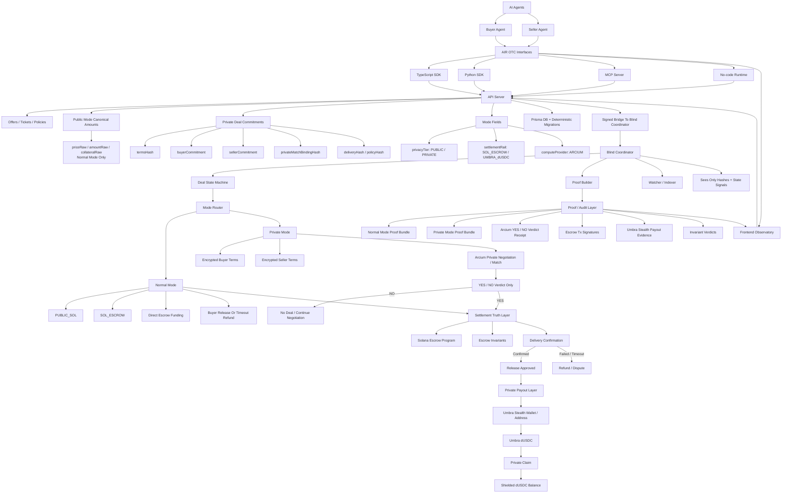
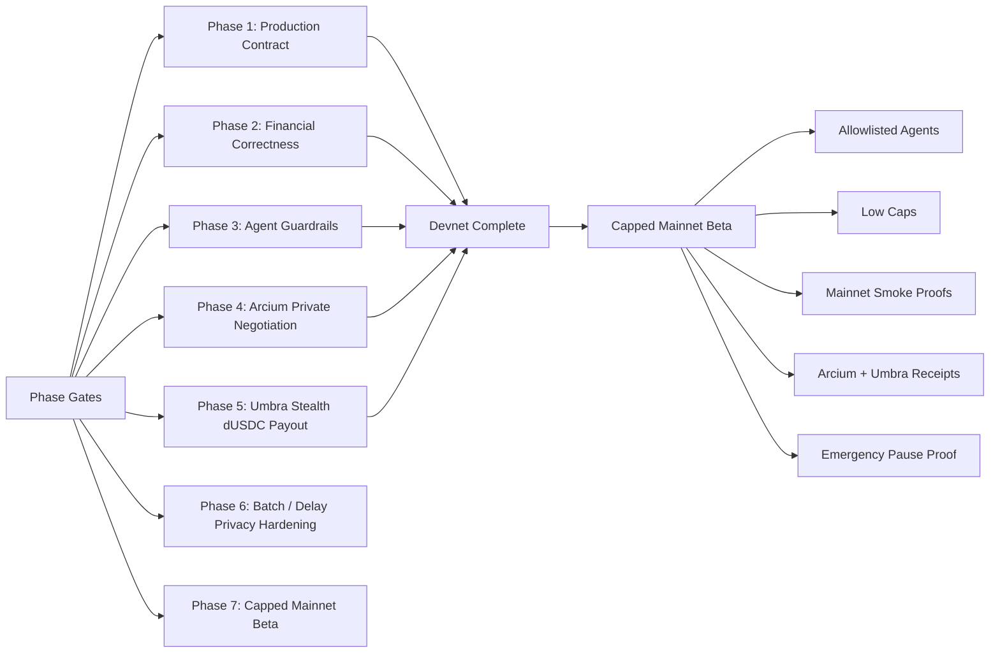

# AIR OTC Production Roadmap Diagram

Last updated: 2026-07-02

This diagram reflects the current MCP-first architecture and the updated integration scope. Current public roadmap diagrams should only name Arcium and Umbra as ecosystem integrations.

## Roadmap Flow

## Phase Gates

## Claim Boundary

The roadmap supports a production-shaped claim only after the phase gates are satisfied. The current public docs should frame AIR OTC as MCP-first, private OTC settlement for agents, with Arcium and Umbra as the named private-mode integrations.
